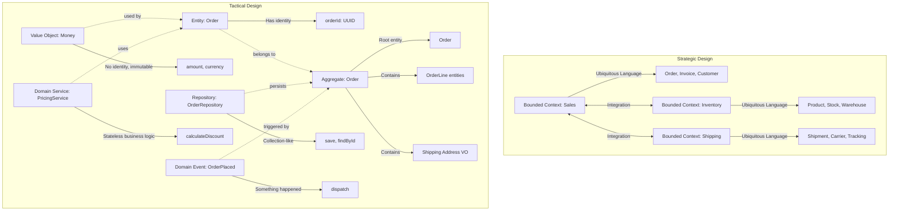
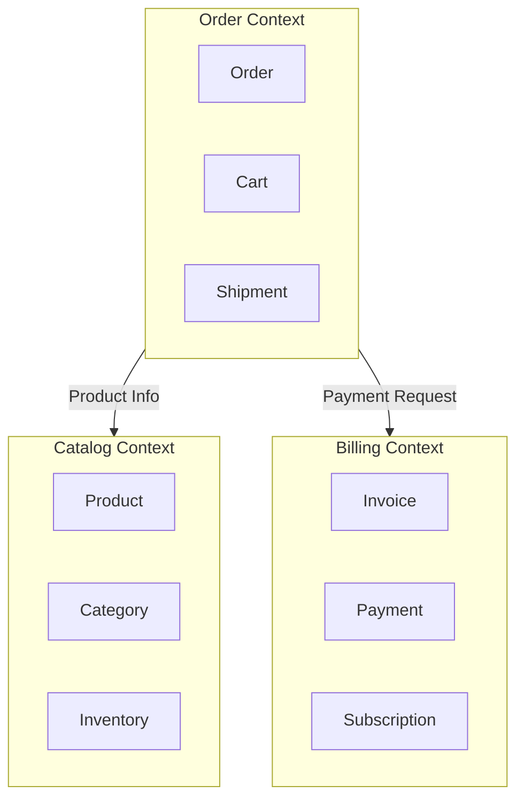

# Chapter 1: Domain-Driven Design

## Learning Objectives

- Understand DDD strategic design
- Implement entities, value objects, and aggregates
- Create domain services and repositories
- Apply bounded contexts

---



## 1.1 DDD Building Blocks

```php
<?php
// Value Object (immutable, identified by attributes)
final class Money
{
    public function __construct(
        private readonly int $amount,
        private readonly string $currency
    ) {
        if ($amount < 0) {
            throw new DomainException('Amount cannot be negative');
        }
        if (!in_array($currency, ['USD', 'EUR', 'GBP'])) {
            throw new DomainException('Invalid currency');
        }
    }

    public function add(Money $other): Money
    {
        if ($this->currency !== $other->currency) {
            throw new DomainException('Cannot add different currencies');
        }
        return new Money($this->amount + $other->amount, $this->currency);
    }

    public function getAmount(): int { return $this->amount; }
    public function getCurrency(): string { return $this->currency; }
}

// Entity (mutable, identified by ID)
final class Order
{
    public function __construct(
        private OrderId $id,
        private CustomerId $customerId,
        private OrderStatus $status,
        private array $lineItems,
        private Money $total,
        private \DateTimeImmutable $createdAt
    ) {}

    public function addItem(Product $product, int $quantity): void
    {
        if ($this->status !== OrderStatus::DRAFT) {
            throw new DomainException('Cannot modify non-draft order');
        }

        $this->lineItems[] = new LineItem($product, $quantity);
        $this->recalculateTotal();
    }

    public function place(): void
    {
        if (empty($this->lineItems)) {
            throw new DomainException('Cannot place empty order');
        }
        $this->status = OrderStatus::PLACED;
    }

    private function recalculateTotal(): void
    {
        $total = new Money(0, 'USD');
        foreach ($this->lineItems as $item) {
            $total = $total->add($item->getSubtotal());
        }
        $this->total = $total;
    }
}

// Aggregate Root (consistency boundary)
final class Customer
{
    /** @var Order[] */
    private array $orders = [];

    public function __construct(
        private CustomerId $id,
        private string $name,
        private Email $email,
    ) {}

    public function placeOrder(array $items): Order
    {
        $order = new Order(
            OrderId::generate(),
            $this->id,
            OrderStatus::DRAFT,
            [],
            new Money(0, 'USD'),
            new \DateTimeImmutable()
        );

        foreach ($items as $item) {
            $order->addItem($item['product'], $item['quantity']);
        }

        $order->place();
        $this->orders[] = $order;

        return $order;
    }
}

// Domain Service
final class PricingService
{
    public function calculateTotal(array $lineItems, string $currency): Money
    {
        $total = new Money(0, $currency);
        
        foreach ($lineItems as $item) {
            $subtotal = $item->getProduct()->getPrice()
                ->multiply($item->getQuantity());
            $total = $total->add($subtotal);
        }

        return $total;
    }
}
```

---

## 1.2 Bounded Contexts



---

## 1.3 Exercises

1. Identify value objects, entities, and aggregates in an e-commerce domain
2. Implement a Money value object with currency validation
3. Create an Order aggregate with business rules
4. Design bounded contexts for a banking system
5. Implement a domain service for discount calculation

---

## Further Reading

- **Book:** "Domain-Driven Design" by Eric Evans
- **Book:** "Implementing Domain-Driven Design" by Vaughn Vernon
