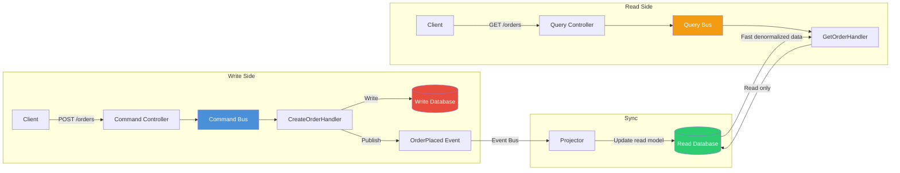

# Chapter 2: CQRS Pattern

## Learning Objectives

- Understand command/query separation
- Implement command and query buses
- Handle event sourcing with CQRS
- Build CQRS-based applications

---



## 2.1 CQRS Implementation

```php
<?php
namespace App\CQRS;

// Command
class CreateOrderCommand
{
    public function __construct(
        public readonly string $customerId,
        public readonly array $items,
        public readonly string $paymentMethod,
    ) {}
}

// Command Handler
class CreateOrderHandler
{
    public function __construct(
        private OrderRepository $orders,
        private EventDispatcher $events,
    ) {}

    public function handle(CreateOrderCommand $command): OrderId
    {
        $order = Order::create(
            customerId: $command->customerId,
            items: $command->items,
            paymentMethod: $command->paymentMethod,
        );

        $this->orders->save($order);
        $this->events->dispatch(new OrderCreated($order->id));

        return $order->id;
    }
}

// Query
class GetOrderQuery
{
    public function __construct(
        public readonly string $orderId,
    ) {}
}

// Query Handler
class GetOrderHandler
{
    public function __construct(private OrderRepository $orders) {}

    public function handle(GetOrderQuery $query): OrderDTO
    {
        $order = $this->orders->find($query->orderId);
        return OrderDTO::fromEntity($order);
    }
}

// Command/Query Bus
interface CommandBus
{
    public function dispatch(Command $command): mixed;
}

interface QueryBus
{
    public function ask(Query $query): mixed;
}
```

---

## 2.2 Exercises

1. Build a CQRS bus with command and query handlers
2. Implement separate read/write models
3. Add event sourcing with an event store
4. Create projections for read model updates

---

## Further Reading

- **Doc:** [CQRS Pattern](https://martinfowler.com/bliki/CQRS.html)
- **Doc:** [Tactician Command Bus](https://tactician.thephpleague.com/)
