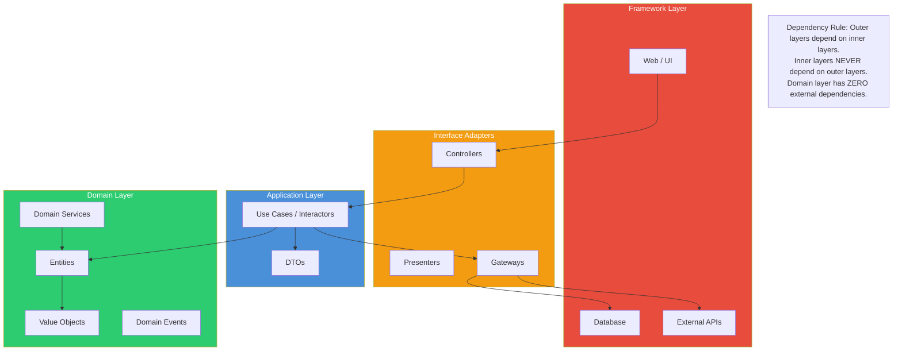

# Chapter 5: Clean Architecture

## Learning Objectives

- Understand Clean Architecture layers
- Apply dependency rule
- Implement use cases
- Build enterprise applications

---



## 5.1 Clean Architecture Layers

```php
<?php
// Layer 1: Entities (Enterprise business rules)
namespace App\Domain\Entities;

class User
{
    public function __construct(
        public readonly UserId $id,
        public string $name,
        public Email $email,
        public Role $role,
    ) {}

    public function changeEmail(Email $newEmail): void
    {
        if ($this->role->cannot(Role::CHANGE_EMAIL)) {
            throw new DomainException('User cannot change email');
        }
        $this->email = $newEmail;
    }
}

// Layer 2: Use Cases (Application business rules)
namespace App\Application\UseCases;

class RegisterUserUseCase
{
    public function __construct(
        private UserRepository $users,
        private PasswordHasher $hasher,
        private EventDispatcher $events,
    ) {}

    public function execute(RegisterUserRequest $request): UserResponse
    {
        $email = new Email($request->email);
        
        if ($this->users->exists($email)) {
            throw new UserAlreadyExistsException();
        }

        $user = new User(
            id: UserId::generate(),
            name: $request->name,
            email: $email,
            role: Role::USER,
        );

        $this->users->save($user);
        $this->events->dispatch(new UserRegistered($user->id));

        return UserResponse::fromEntity($user);
    }
}

// Layer 3: Interface Adapters
namespace App\InterfaceAdapters\Controllers;

class RegisterUserController
{
    public function __construct(
        private RegisterUserUseCase $useCase,
    ) {}

    public function __invoke(Request $request): Response
    {
        try {
            $result = $this->useCase->execute(
                new RegisterUserRequest(
                    name: $request->input('name'),
                    email: $request->input('email'),
                    password: $request->input('password'),
                )
            );

            return new JsonResponse($result, 201);
        } catch (UserAlreadyExistsException $e) {
            return new JsonResponse(['error' => 'User exists'], 409);
        } catch (ValidationException $e) {
            return new JsonResponse(['error' => $e->getMessage()], 422);
        }
    }
}

// Layer 4: Frameworks & Drivers
// Laravel controller, MySQL repository, etc.
```

---

## 5.2 Exercises

1. Build a feature following Clean Architecture layers
2. Implement the dependency rule (inner layers don't know outer)
3. Create interfaces at each boundary
4. Swap frameworks without changing use cases

---

## Further Reading

- **Book:** "Clean Architecture" by Robert C. Martin
- **Book:** "PHP Architecture" by Matthias Noback
