# Chapter 15: CI/CD Pipelines

## Learning Objectives

- Set up GitHub Actions for PHP
- Automate testing and deployment
- Implement quality gates
- Build deployment pipelines

---



```mermaid
flowchart LR
    A[Developer pushes code] --> B[GitHub / GitLab]
    B --> C[CI Pipeline Triggered]

    subgraph CI [Continuous Integration]
        direction TD
        C1[Composer Install]
        C2[PHPStan Analysis]
        C3[PHP-CS-Fixer]
        C4[PHPUnit Tests]
        C5[Security Audit]
        C1 --> C2 --> C3 --> C4 --> C5
    end

    C --> CI
    C5 --> Q{All checks pass?}
    Q -->|No| R[❌ Build failed - notify team]
    Q -->|Yes| S[✅ Artifact: build artifact]

    subgraph CD [Continuous Deployment]
        S --> D1[Build Docker image]
        D1 --> D2[Push to registry]
        D2 --> D3{Environment}
        D3 -->|Staging| D4[Deploy to staging]
        D4 --> D5[Run smoke tests]
        D5 --> D6{Tests pass?}
        D6 -->|Yes| D7[Deploy to production]
        D6 -->|No| D8[Rollback staging]
        D3 -->|Production| D7
        D7 --> D9[Health check]
        D9 --> D10{Healthy?}
        D10 -->|Yes| D11[Done]
        D10 -->|No| D12[Auto-rollback]
    end

    style A fill:#4a90d9,color:#fff
    style C4 fill:#2ecc71,color:#fff
    style C5 fill:#e74c3c,color:#fff
    style S fill:#f39c12,color:#fff
    style D7 fill:#2ecc71,color:#fff
```

## 15.1 GitHub Actions

```yaml
# .github/workflows/ci.yml
name: CI Pipeline

on:
  push:
    branches: [main, develop]
  pull_request:
    branches: [main]

jobs:
  quality:
    name: Code Quality
    runs-on: ubuntu-latest
    
    services:
      mysql:
        image: mysql:8.0
        env:
          MYSQL_ALLOW_EMPTY_PASSWORD: yes
          MYSQL_DATABASE: test
        ports:
          - 3306:3306
        options: --health-cmd="mysqladmin ping" --health-interval=10s --health-timeout=5s --health-retries=3

    steps:
      - uses: actions/checkout@v4

      - name: Setup PHP
        uses: shivammathur/setup-php@v2
        with:
          php-version: 8.2
          extensions: mbstring, xml, pdo_mysql, redis
          coverage: xdebug
          tools: composer, phpstan, php-cs-fixer

      - name: Cache Composer
        uses: actions/cache@v3
        with:
          path: vendor
          key: composer-${{ hashFiles('composer.lock') }}

      - name: Install Dependencies
        run: composer install --no-progress --prefer-dist

      - name: PHPStan
        run: vendor/bin/phpstan analyse --level=max --no-progress

      - name: PHP-CS-Fixer
        run: vendor/bin/php-cs-fixer fix --dry-run --diff

      - name: Run Tests
        run: vendor/bin/phpunit --coverage-clover=coverage.xml

      - name: Upload Coverage
        uses: codecov/codecov-action@v3
        with:
          files: coverage.xml

  deploy:
    name: Deploy
    needs: quality
    if: github.ref == 'refs/heads/main'
    runs-on: ubuntu-latest

    steps:
      - uses: actions/checkout@v4

      - name: Deploy to Production
        uses: deployphp/action@v1
        with:
          private-key: ${{ secrets.DEPLOY_KEY }}
          known-hosts: ${{ secrets.KNOWN_HOSTS }}
          dep: deploy production
```

---

## 15.2 Exercises

1. Create a CI pipeline with PHPStan, CS fixer, and tests
2. Add automatic deployments to staging on PR merge
3. Implement quality gates (code coverage thresholds)
4. Build a deployment pipeline with zero-downtime

---

## Further Reading

- **Doc:** [GitHub Actions](https://docs.github.com/en/actions)
- **Doc:** [Deployer](https://deployer.org/)
