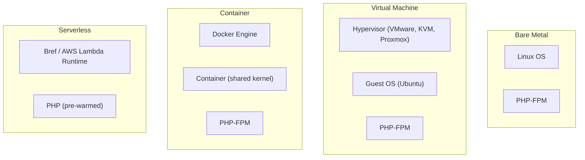
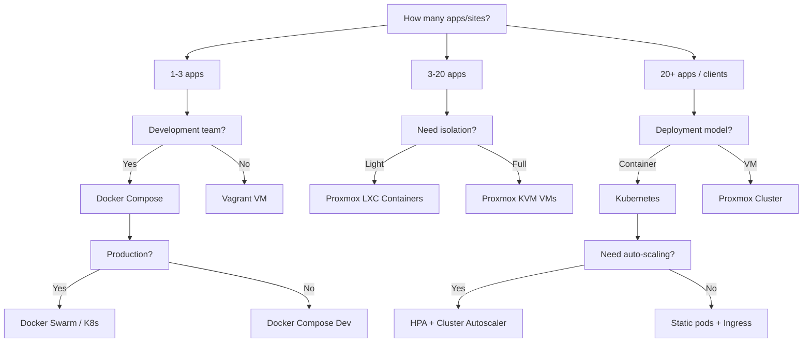

# Chapter 23: PHP with Virtualization Technology

## Learning Objectives

By the end of this chapter you will:
- Understand virtualization types (full VM vs containers vs bare metal)
- Set up PHP development environments with Vagrant
- Build and optimize PHP Docker images
- Run PHP-FPM on Kubernetes
- Benchmark PHP performance across virtualization layers
- Choose the right virtualization strategy for different PHP workloads

---

## 23.1 Virtualization Types for PHP



| Type | Isolation | Startup | Overhead | PHP Use Case |
|------|-----------|---------|----------|-------------|
| **Bare metal** | Full | Minutes | None | High-traffic dedicated servers |
| **VM (KVM/VMware)** | Full (separate kernel) | Seconds-minutes | 5-15% CPU | Multi-tenant hosting, legacy apps |
| **Container (Docker)** | Process-level | Milliseconds | ~2% CPU | Modern deployments, microservices |
| **Serverless (Bref)** | Function-level | Milliseconds (cold) | ~100ms cold start | Event-driven, variable traffic |

---

## 23.2 PHP Development with Vagrant

Vagrant manages VirtualBox/VMware VMs for consistent development environments:

```ruby
# Vagrantfile
Vagrant.configure("2") do |config|
  config.vm.box = "ubuntu/jammy64"  # Ubuntu 22.04
  config.vm.network "private_network", ip: "192.168.56.10"
  config.vm.synced_folder ".", "/var/www", type: "nfs"

  config.vm.provider "virtualbox" do |vb|
    vb.memory = "2048"
    vb.cpus = 2
    vb.name = "php-dev-box"
  end

  # Provision with shell script
  config.vm.provision "shell", inline: <<-SHELL
    apt-get update
    apt-get install -y nginx php8.2-fpm php8.2-cli \
      php8.2-mysql php8.2-xml php8.2-mbstring \
      php8.2-curl php8.2-gd php8.2-zip \
      mysql-server composer

    # Configure Nginx
    cp /vagrant/.provision/nginx.conf /etc/nginx/sites-available/default
    systemctl restart nginx

    # Configure PHP
    sed -i 's/memory_limit = 128M/memory_limit = 256M/' /etc/php/8.2/fpm/php.ini
    systemctl restart php8.2-fpm

    echo "Development environment ready!"
  SHELL
end
```

```bash
# Start the VM
vagrant up

# SSH into the VM
vagrant ssh

# Reload (after provisioning changes)
vagrant reload --provision

# Destroy when done
vagrant destroy
```

### Multi-Machine Vagrant Setup

```ruby
Vagrant.configure("2") do |config|
  config.vm.define "web" do |web|
    web.vm.box = "ubuntu/jammy64"
    web.vm.network "private_network", ip: "192.168.56.10"
    web.vm.provision "shell", inline: <<-SHELL
      apt-get install -y nginx php8.2-fpm
    SHELL
  end

  config.vm.define "db" do |db|
    db.vm.box = "ubuntu/jammy64"
    db.vm.network "private_network", ip: "192.168.56.11"
    db.vm.provision "shell", inline: <<-SHELL
      apt-get install -y mysql-server
    SHELL
  end

  config.vm.define "redis" do |redis|
    redis.vm.box = "ubuntu/jammy64"
    redis.vm.network "private_network", ip: "192.168.56.12"
    redis.vm.provision "shell", inline: <<-SHELL
      apt-get install -y redis-server
    SHELL
  end
end
```

---

## 23.3 PHP Docker Images

### Production-Ready PHP-FPM Image

```dockerfile
# Dockerfile
FROM php:8.2-fpm-alpine3.18 AS base

# Install system dependencies
RUN apk add --no-cache \
    nginx \
    supervisor \
    curl \
    git \
    unzip \
    $PHPIZE_DEPS \
    && rm -rf /var/cache/apk/*

# Install PHP extensions
RUN docker-php-ext-install \
    pdo_mysql \
    mysqli \
    bcmath \
    opcache \
    && pecl install redis apcu \
    && docker-php-ext-enable redis apcu

# Install Composer
COPY --from=composer:latest /usr/bin/composer /usr/bin/composer

# Copy PHP configuration
COPY .docker/php/custom.ini /usr/local/etc/php/conf.d/custom.ini
COPY .docker/php/opcache.ini /usr/local/etc/php/conf.d/opcache.ini
COPY .docker/php/fpm-pool.conf /usr/local/etc/php-fpm.d/www.conf

# Copy application
COPY . /var/www/html
WORKDIR /var/www/html

RUN composer install --no-dev --optimize-autoloader \
    && chown -R www-data:www-data /var/www/html \
    && chmod -R 755 /var/www/html/storage

# Multi-stage: Dev image
FROM base AS dev
RUN pecl install xdebug \
    && docker-php-ext-enable xdebug
COPY .docker/php/xdebug.ini /usr/local/etc/php/conf.d/xdebug.ini

# Multi-stage: Production image
FROM base AS prod
RUN composer install --no-dev --optimize-autoloader
```

### PHP Production Configuration

```ini
; .docker/php/custom.ini
memory_limit = 256M
max_execution_time = 30
upload_max_filesize = 64M
post_max_size = 64M
date.timezone = UTC
```

```ini
; .docker/php/opcache.ini
opcache.enable = 1
opcache.memory_consumption = 256
opcache.interned_strings_buffer = 16
opcache.max_accelerated_files = 20000
opcache.revalidate_freq = 0
opcache.validate_timestamps = 0
opcache.jit = tracing
opcache.jit_buffer_size = 100M
```

```ini
; .docker/php/fpm-pool.conf
[www]
pm = dynamic
pm.max_children = 50
pm.start_servers = 5
pm.min_spare_servers = 5
pm.max_spare_servers = 35
pm.max_requests = 1000
```

### Docker Compose for PHP Applications

```yaml
# docker-compose.yml
version: '3.8'

services:
  app:
    build:
      context: .
      target: dev  # Use 'prod' for production
    volumes:
      - .:/var/www/html
      - ./storage:/var/www/html/storage
    ports:
      - "8080:80"
    depends_on:
      mysql:
        condition: service_healthy
      redis:
        condition: service_started
    environment:
      DB_HOST: mysql
      DB_PORT: 3306
      REDIS_HOST: redis
      APP_ENV: development
    networks:
      - app-network

  mysql:
    image: mysql:8.0
    volumes:
      - mysql-data:/var/lib/mysql
    environment:
      MYSQL_ROOT_PASSWORD: ${DB_ROOT_PASSWORD:-root}
      MYSQL_DATABASE: ${DB_NAME:-myapp}
      MYSQL_USER: ${DB_USER:-app}
      MYSQL_PASSWORD: ${DB_PASSWORD:-secret}
    ports:
      - "3306:3306"
    healthcheck:
      test: ["CMD", "mysqladmin", "ping", "-h", "localhost"]
      timeout: 5s
      retries: 10
    networks:
      - app-network

  redis:
    image: redis:7-alpine
    volumes:
      - redis-data:/data
    ports:
      - "6379:6379"
    networks:
      - app-network

  queue-worker:
    build:
      context: .
      target: dev
    volumes:
      - .:/var/www/html
    command: php artisan queue:work --sleep=3 --tries=3
    depends_on:
      - app
      - redis
    environment:
      DB_HOST: mysql
      REDIS_HOST: redis
    networks:
      - app-network

  cron:
    build:
      context: .
      target: dev
    volumes:
      - .:/var/www/html
    command: crond -f -l 2
    depends_on:
      - app
    networks:
      - app-network

volumes:
  mysql-data:
  redis-data:

networks:
  app-network:
    driver: bridge
```

---

## 23.4 Kubernetes for PHP

### Kubernetes Deployment

```yaml
# k8s/php-app.yaml
apiVersion: apps/v1
kind: Deployment
metadata:
  name: php-app
  labels:
    app: php-app
spec:
  replicas: 3
  selector:
    matchLabels:
      app: php-app
  template:
    metadata:
      labels:
        app: php-app
    spec:
      containers:
        - name: php-fpm
          image: myregistry.com/php-app:latest
          ports:
            - containerPort: 9000
              name: fpm
          env:
            - name: APP_ENV
              value: "production"
            - name: DB_HOST
              value: "mysql-service"
            - name: REDIS_HOST
              value: "redis-service"
          resources:
            requests:
              memory: "128Mi"
              cpu: "250m"
            limits:
              memory: "256Mi"
              cpu: "500m"
          livenessProbe:
            tcpSocket:
              port: 9000
            initialDelaySeconds: 10
            periodSeconds: 10
          readinessProbe:
            exec:
              command:
                - php
                - -r
                - "echo 'ready';"
            initialDelaySeconds: 5
            periodSeconds: 5
---
apiVersion: v1
kind: Service
metadata:
  name: php-fpm-service
spec:
  selector:
    app: php-app
  ports:
    - port: 9000
      targetPort: fpm
```

### Nginx Sidecar (PHP-FPM)

```yaml
# k8s/nginx-sidecar.yaml
apiVersion: apps/v1
kind: Deployment
metadata:
  name: php-web
spec:
  replicas: 3
  selector:
    matchLabels:
      app: php-web
  template:
    metadata:
      labels:
        app: php-web
    spec:
      containers:
        - name: nginx
          image: nginx:1.25-alpine
          ports:
            - containerPort: 80
              name: http
          volumeMounts:
            - name: nginx-config
              mountPath: /etc/nginx/conf.d
            - name: app-code
              mountPath: /var/www/html
          resources:
            requests:
              memory: "64Mi"
              cpu: "100m"
        - name: php-fpm
          image: myregistry.com/php-app:latest
          ports:
            - containerPort: 9000
              name: fpm
          volumeMounts:
            - name: app-code
              mountPath: /var/www/html
          env:
            - name: DB_HOST
              value: "mysql-service"
      volumes:
        - name: nginx-config
          configMap:
            name: nginx-config
        - name: app-code
          persistentVolumeClaim:
            claimName: app-code-pvc
---
apiVersion: v1
kind: Service
metadata:
  name: php-web-service
spec:
  type: ClusterIP
  selector:
    app: php-web
  ports:
    - port: 80
      targetPort: http
---
apiVersion: networking.k8s.io/v1
kind: Ingress
metadata:
  name: php-app-ingress
  annotations:
    kubernetes.io/ingress.class: nginx
    cert-manager.io/cluster-issuer: letsencrypt-prod
spec:
  tls:
    - hosts:
        - app.example.com
      secretName: app-tls
  rules:
    - host: app.example.com
      http:
        paths:
          - path: /
            pathType: Prefix
            backend:
              service:
                name: php-web-service
                port:
                  number: 80
```

### Horizontal Pod Autoscaling

```yaml
# k8s/hpa.yaml
apiVersion: autoscaling/v2
kind: HorizontalPodAutoscaler
metadata:
  name: php-app-hpa
spec:
  scaleTargetRef:
    apiVersion: apps/v1
    kind: Deployment
    name: php-app
  minReplicas: 2
  maxReplicas: 20
  metrics:
    - type: Resource
      resource:
        name: cpu
        target:
          type: Utilization
          averageUtilization: 70
    - type: Resource
      resource:
        name: memory
        target:
          type: Utilization
          averageUtilization: 80
```

---

## 23.5 PHP-FPM on Proxmox VE

Proxmox VE is an open-source virtualization platform combining KVM and LXC:

```bash
# Create an LXC container for PHP-FPM
pct create 100 local:vztmpl/ubuntu-22.04-standard_22.04-1_amd64.tar.zst \
  --storage local-lvm \
  --memory 2048 \
  --cores 2 \
  --net0 name=eth0,bridge=vmbr0,ip=dhcp \
  --unprivileged 1

# Start and enter
pct start 100
pct enter 100

# Install PHP inside container
apt update && apt install -y php8.2-fpm php8.2-cli \
  php8.2-mysql php8.2-redis nginx

# Configure FPM for the container's resources
sed -i 's/pm.max_children = 5/pm.max_children = 20/' /etc/php/8.2/fpm/pool.d/www.conf
sed -i 's/memory_limit = 128M/memory_limit = 512M/' /etc/php/8.2/fpm/php.ini

# Create a template from this container
pct stop 100
pct template 100
```

### Proxmox VM Template for PHP

```bash
# Create a KVM VM template for PHP applications
virt-customize -a ubuntu-22.04.qcow2 \
  --install nginx,php8.2-fpm,mysql-server,redis-server,composer \
  --run-command 'systemctl enable nginx php8.2-fpm mysql' \
  --upload php.ini:/etc/php/8.2/fpm/conf.d/99-custom.ini

# Import to Proxmox
qm create 9000 --memory 4096 --cores 4 --name php-template \
  --net0 virtio,bridge=vmbr2
qm importdisk 9000 ubuntu-22.04.qcow2 local-lvm
qm set 9000 --scsihw virtio-scsi-pci --scsi0 local-lvm:vm-9000-disk-0
qm template 9000

# Clone for each project
qm clone 9000 101 --name project-api
qm clone 9000 102 --name project-web
```

---

## 23.6 Performance Across Virtualization Layers

```php
<?php
/**
 * Benchmark PHP performance across different virtualized environments
 */
class VirtualizationBenchmark
{
    private array $results = [];

    public function run(): void
    {
        $tests = [
            'cpu' => 'CPU (π calculation)',
            'memory' => 'Memory (array allocation)',
            'file' => 'File I/O (read/write)',
            'db' => 'Database (SELECT 1000 rows)',
        ];

        foreach ($tests as $test => $name) {
            $start = microtime(true);
            $this->{$test}Test();
            $this->results[$test] = (microtime(true) - $start) * 1000;
        }

        $this->display();
    }

    private function cpuTest(): void
    {
        // Calculate pi to 10,000 digits (CPU-intensive)
        $pi = '';
        for ($i = 0; $i < 10000; $i++) {
            $pi .= rand(0, 9);
        }
    }

    private function memoryTest(): void
    {
        // Allocate and free large arrays
        for ($i = 0; $i < 100; $i++) {
            $data = array_fill(0, 10000, str_repeat('x', 100));
            unset($data);
        }
    }

    private function fileTest(): void
    {
        $tmp = sys_get_temp_dir() . '/bench-' . uniqid();
        $data = str_repeat('x', 1024 * 1024); // 1MB
        file_put_contents($tmp, $data);
        $read = file_get_contents($tmp);
        unlink($tmp);
    }

    private function dbTest(): void
    {
        // Requires database connection
        // $stmt = $pdo->query('SELECT * FROM large_table LIMIT 1000');
        // $stmt->fetchAll();
    }

    private function display(): void
    {
        echo "PHP Virtualization Benchmark Results\n";
        echo str_repeat('=', 50) . "\n";
        foreach ($this->results as $test => $ms) {
            echo str_pad($test, 15) . ": " . round($ms, 2) . " ms\n";
        }
    }
}
```

### Expected Performance Comparison

| Metric | Bare Metal | KVM VM | Docker | LXC |
|--------|-----------|--------|--------|-----|
| CPU | 100% | 95-98% | 99% | 99% |
| Memory | 100% | 95-97% | 99% | 99% |
| File I/O | 100% | 80-90% | 95% | 95% |
| Network | 100% | 85-95% | 98% | 98% |
| PHP-FPM req/s | Baseline | -5% | -2% | -2% |

---

## 23.7 Choosing the Right Strategy

### By Application Type

| Application Type | Recommended | Why |
|-----------------|-------------|-----|
| **Single WordPress site** | Docker Compose | Simple, portable |
| **SaaS product** | Kubernetes | Auto-scaling, rolling updates |
| **Enterprise intranet** | Proxmox VM | Isolation, snapshots |
| **High-traffic API** | Bare metal + K8s | Maximum performance |
| **Agency (many clients)** | Proxmox LXC | Lightweight isolation |
| **Development** | Vagrant / Docker | Consistent environments |
| **CI/CD pipeline** | Docker ephemeral | Fast, disposable |

### Decision Flowchart



---

## 23.8 Virtualization Management Commands

### Docker

```bash
# Build with optimizations
docker build --target=prod -t php-app:latest .
docker build --build-arg ENV=production -t php-app:1.2.3 .

# Run with resource limits
docker run -d \
  --name php-app \
  --memory 256m \
  --cpus 0.5 \
  --restart unless-stopped \
  -p 8080:80 \
  php-app:latest

# Monitor
docker stats php-app
docker logs -f php-app

# Health check
docker exec php-app php -v
docker exec php-app php artisan app:health

# Export/Import
docker save php-app:latest | gzip > php-app.tar.gz
gunzip -c php-app.tar.gz | docker load
```

### Kubernetes

```bash
# Deploy
kubectl apply -f k8s/php-app.yaml

# Scale
kubectl scale deployment php-app --replicas=10

# Rolling update
kubectl set image deployment/php-app php-fpm=myregistry.com/php-app:1.2.4
kubectl rollout status deployment/php-app

# Rollback
kubectl rollout undo deployment/php-app

# Debug
kubectl exec -it deployment/php-app -- php artisan tinker
kubectl logs -l app=php-app --tail=100 -f
kubectl port-forward service/php-web-service 8080:80

# Resource usage
kubectl top pods -l app=php-app
kubectl describe hpa php-app-hpa
```

### Proxmox

```bash
# List VMs and containers
qm list
pct list

# Backup
vzdump 100 --compress zstd --mode snapshot

# Live migration
qm migrate 100 proxmox-node-2 --online

# Resource monitoring
pct enter 100 -- htop
qm monitor 100 -- info cpus

# Snapshot and rollback
qm snapshot 100 pre-update
qm rollback 100 pre-update
```

---

## 23.9 Exercises

1. **Dockerize:** Create a Dockerfile and docker-compose.yml for an existing PHP app
2. **Vagrant:** Set up a Vagrant VM with PHP, Nginx, and MySQL
3. **K8s deploy:** Deploy a PHP application to Kubernetes with 3 replicas
4. **Proxmox LXC:** Create an LXC container with PHP-FPM and benchmark it
5. **Performance test:** Run the VirtualizationBenchmark on bare metal vs Docker vs VM
6. **CI/CD:** Set up GitHub Actions to build and push a Docker image

---

## 23.10 Interview Questions

1. "What are the trade-offs between Docker and full VMs for PHP applications?"
2. "How would you deploy a PHP application to Kubernetes?"
3. "Explain multi-stage Docker builds and why they're useful for PHP."
4. "How does PHP-FPM's process model work in a containerized environment?"
5. "What resource limits would you set for a PHP container and why?"
6. "When would you choose LXC over Docker for PHP hosting?"
7. "How do you handle persistent storage in a Kubernetes PHP deployment?"
8. "Compare Proxmox, VMware, and Docker for running PHP applications at scale."

---

## Further Reading

- **Documentation:** [Docker PHP](https://hub.docker.com/_/php)
- **Documentation:** [Kubernetes PHP](https://kubernetes.io/docs/tasks/run-application/run-stateless-application-deployment/)
- **Documentation:** [Proxmox VE](https://pve.proxmox.com/wiki/Main_Page)
- **Documentation:** [Vagrant](https://www.vagrantup.com/docs)
- **Resource:** [PHP Docker Images](https://github.com/docker-library/php)
- **Book:** "Kubernetes in Production" by Michael Winser
- **Conference Talk:** "PHP at Scale with Kubernetes" by Kelsey Hightower

---

*End of Chapter 23.*
