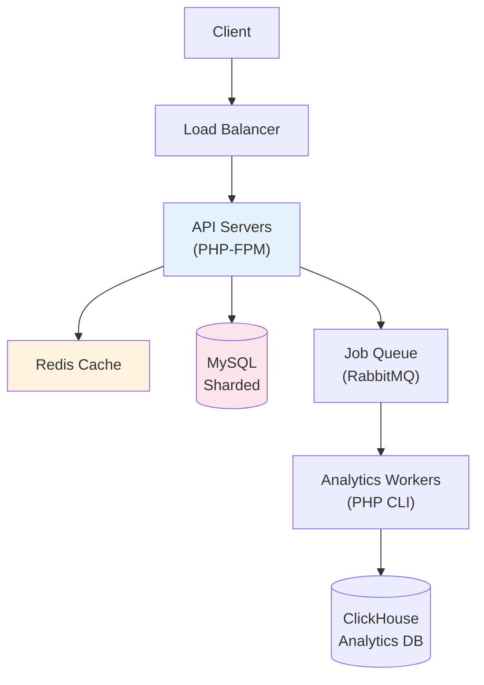
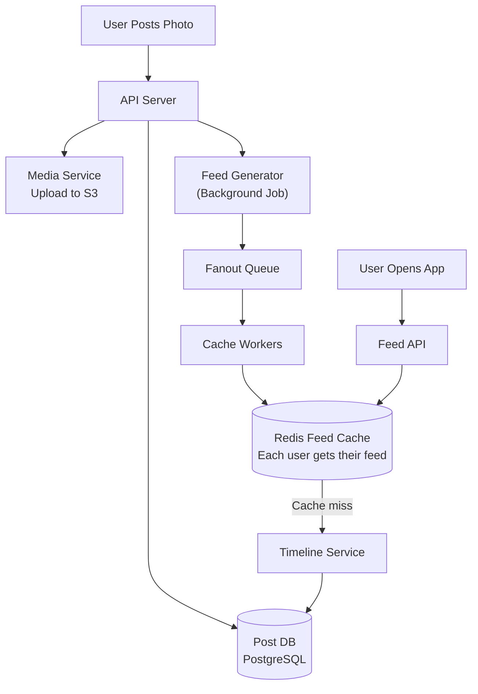
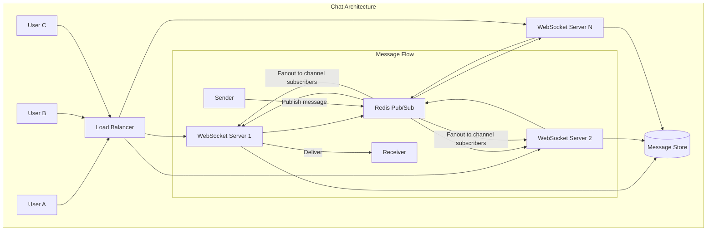

# Chapter 1: System Design for PHP

## Learning Objectives

- Design scalable PHP systems
- Apply proven architectural patterns
- Handle 10M+ users with PHP
- Make architecture decisions with confidence

---

## 1.1 Design a URL Shortener



### Requirements

```php
<?php
// Functional requirements
// 1. Create short URL: POST /shorten → {long_url} → {short_code}
// 2. Redirect: GET /{short_code} → 301 → long_url
// 3. Track clicks (async via queue)
// 4. Analytics per short URL

// Non-functional requirements
// 1. Read: 100K QPS (queries per second)
// 2. Write: 1K QPS
// 3. P99 latency < 50ms for redirects
// 4. 99.99% uptime

// URL Shortener - Core Service
class UrlShortenerService
{
    public function __construct(
        private readonly UrlRepository $urls,
        private readonly CacheInterface $cache,
        private readonly QueueInterface $queue,
        private readonly IdGeneratorInterface $ids,
    ) {}

    public function shorten(string $longUrl, ?string $customCode = null): ShortenedUrl
    {
        // Validate URL
        if (!filter_var($longUrl, FILTER_VALIDATE_URL)) {
            throw new ValidationException('Invalid URL');
        }

        // Check for existing
        $existing = $this->urls->findByLongUrl($longUrl);
        if ($existing) {
            return $existing;
        }

        // Generate or use custom code
        $code = $customCode ?? $this->ids->generate();
        
        // Ensure uniqueness
        if ($this->urls->exists($code)) {
            throw new ConflictException('Code already in use');
        }

        // Store
        $url = new ShortenedUrl(
            id: $this->ids->generate(),
            code: $code,
            longUrl: $longUrl,
            createdAt: new DateTimeImmutable()
        );
        
        $this->urls->save($url);
        $this->cache->set("url:{$code}", $longUrl, 86400 * 7); // Cache 7 days

        return $url;
    }

    public function resolve(string $code): ?string
    {
        // Check cache first
        $cached = $this->cache->get("url:{$code}");
        if ($cached !== null) {
            $this->trackClickAsync($code);
            return $cached;
        }

        // Check database
        $url = $this->urls->findByCode($code);
        if ($url === null) {
            return null;
        }

        // Populate cache
        $this->cache->set("url:{$code}", $url->longUrl, 86400 * 7);
        
        $this->trackClickAsync($code);
        return $url->longUrl;
    }

    private function trackClickAsync(string $code): void
    {
        $this->queue->dispatch(new TrackClick(
            code: $code,
            timestamp: time(),
            ip: $_SERVER['REMOTE_ADDR'] ?? 'unknown',
            userAgent: $_SERVER['HTTP_USER_AGENT'] ?? 'unknown',
        ));
    }
}
```

### Database Design

```sql
-- URLs table (sharded by code_hash)
CREATE TABLE urls (
    id BIGINT UNSIGNED AUTO_INCREMENT PRIMARY KEY,
    code VARCHAR(10) NOT NULL UNIQUE,
    long_url TEXT NOT NULL,
    created_at TIMESTAMP DEFAULT CURRENT_TIMESTAMP,
    INDEX idx_code (code)
) ENGINE=InnoDB;

-- Click events (written asynchronously, read from analytics DB)
CREATE TABLE click_events (
    id BIGINT UNSIGNED AUTO_INCREMENT PRIMARY KEY,
    code VARCHAR(10) NOT NULL,
    clicked_at TIMESTAMP NOT NULL,
    ip_address VARCHAR(45),
    user_agent TEXT,
    referer TEXT,
    country VARCHAR(2),
    INDEX idx_code_time (code, clicked_at)
) ENGINE=InnoDB;
```

### Scaling Strategy

```text
1. Database: MySQL with 4 shards (code_hash % 4)
2. Cache: Redis cluster with 6 nodes
3. Queue: RabbitMQ for async click tracking
4. API: PHP-FPM with auto-scaling (target 60% CPU)
5. CDN: Cloudflare for global edge caching
6. Read replicas: 3 per shard for read-heavy traffic
```

---

## 1.2 Design Instagram-Scale Feed



---



## 1.3 Exercises

1. Design a chat system supporting 10M concurrent users
2. Design a payment system handling $1M/day
3. Design a notification system delivering 1B notifications/day
4. Design a real-time analytics dashboard
5. Design a multi-tenant SaaS platform with 100K tenants

---

## 1.4 Interview Questions

1. "Design Twitter's timeline system."
2. "Design a URL shortener like bit.ly."
3. "Design Uber's ride matching system."
4. "Design YouTube's video upload and streaming pipeline."
5. "Design a real-time gaming leaderboard."

---

## Further Reading

- **Book:** "Designing Data-Intensive Applications" by Martin Kleppmann
- **Book:** "System Design Interview" by Alex Xu
- **Resource:** [System Design Primer](https://github.com/donnemartin/system-design-primer)
- **Resource:** [High Scalability Blog](http://highscalability.com/)
