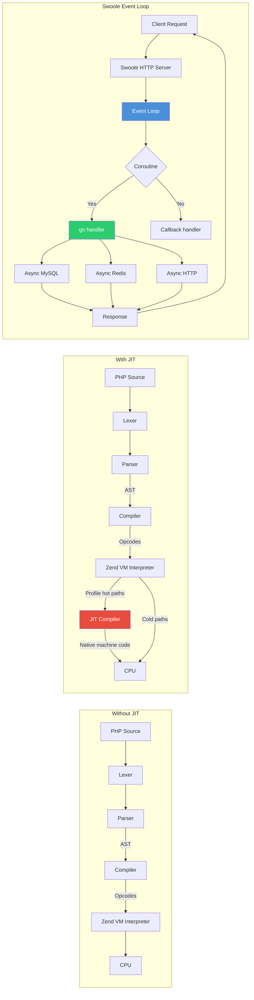

# Chapter 2: High-Performance PHP

## Learning Objectives

- Master PHP JIT compiler
- Implement async PHP with Swoole
- Build high-concurrency applications
- Optimize for maximum throughput

---



## 2.1 PHP JIT Compiler

```php
<?php
// php.ini JIT configuration
// opcache.jit = tracing
// opcache.jit_buffer_size = 100M
// opcache.jit_max_loop_unrolls = 20
// opcache.jit_hot_func = 3
// opcache.jit_hot_loop = 1

class JITBenchmark
{
    public static function measure(callable $fn, int $iterations = 100000): float
    {
        $start = hrtime(true);
        for ($i = 0; $i < $iterations; $i++) {
            $fn();
        }
        return (hrtime(true) - $start) / 1_000_000;
    }
}

$bench = new JITBenchmark();

// Without JIT: ~150ms for 100K iterations
// With JIT: ~30ms for 100K iterations (5x faster)
$time = $bench->measure(fn() => array_sum(range(1, 100)));
echo "Time: {$time}ms\n";

// Swoole async server
use Swoole\Http\Server;
use Swoole\Http\Request;
use Swoole\Http\Response;

$server = new Server('0.0.0.0', 9501);

$server->on('request', function (Request $request, Response $response) {
    // Async MySQL query
    $pool = new Swoole\Coroutine\Channel(10);
    
    go(function () use ($pool) {
        $swoole_mysql = new Swoole\Coroutine\MySQL();
        $swoole_mysql->connect([
            'host' => '127.0.0.1',
            'port' => 3306,
            'user' => 'root',
            'password' => 'root',
            'database' => 'test',
        ]);
        $pool->push($swoole_mysql);
    });

    go(function () use ($response, $pool) {
        $mysql = $pool->pop();
        $result = $mysql->query('SELECT * FROM users LIMIT 10');
        $response->header('Content-Type', 'application/json');
        $response->end(json_encode($result));
    });
});

// $server->start(); // Start: php server.php
```

---

## 2.2 Exercises

1. Benchmark JIT vs no JIT on CPU-intensive operations
2. Build an async HTTP server with Swoole
3. Implement coroutine-based concurrent database queries
4. Compare throughput of PHP-FPM vs Swoole

---

## Further Reading

- **Doc:** [PHP JIT](https://www.php.net/manual/en/jit.configuration.php)
- **Doc:** [Swoole](https://www.swoole.co.uk/docs/)
- **Doc:** [ReactPHP](https://reactphp.org/)
