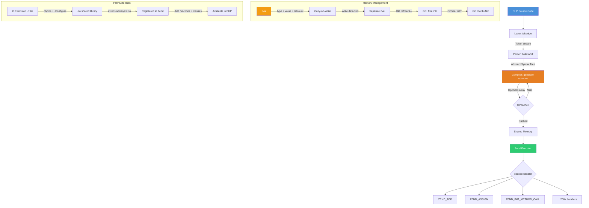

# Chapter 3: PHP Internals

## Learning Objectives

- Understand Zend Engine architecture
- Read and write PHP opcodes
- Extend PHP with C extensions
- Contribute to PHP core

---



## 3.1 Zend Engine Overview

```c
// Zend Engine architecture:
// PHP Source → Lexer (tokenize) → Parser (AST) → Compiler (opcodes) → Executor

// Writing a PHP extension in C
// ext/hello/php_hello.h
#ifndef PHP_HELLO_H
#define PHP_HELLO_H

extern zend_module_entry hello_module_entry;
#define phpext_hello_ptr &hello_module_entry

#define PHP_HELLO_VERSION "1.0.0"

#ifdef ZTS
#include "TSRM.h"
#endif

#endif

// ext/hello/hello.c
#ifdef HAVE_CONFIG_H
#include "config.h"
#endif

#include "php.h"
#include "php_hello.h"

// Function implementation
PHP_FUNCTION(hello_world)
{
    RETURN_STRING("Hello from PHP Extension!");
}

PHP_FUNCTION(hello_sum)
{
    zend_long a, b;

    if (zend_parse_parameters(ZEND_NUM_ARGS(), "ll", &a, &b) == FAILURE) {
        RETURN_THROWS();
    }

    RETURN_LONG(a + b);
}

// Register functions
const zend_function_entry hello_functions[] = {
    PHP_FE(hello_world, NULL)
    PHP_FE(hello_sum, NULL)
    PHP_FE_END
};

// Module entry
zend_module_entry hello_module_entry = {
    STANDARD_MODULE_HEADER,
    "hello",
    hello_functions,
    NULL, // MINIT
    NULL, // MSHUTDOWN
    NULL, // RINIT
    NULL, // RSHUTDOWN
    NULL, // MINFO
    PHP_HELLO_VERSION,
    STANDARD_MODULE_PROPERTIES
};

ZEND_GET_MODULE(hello)
```

---

## 3.2 Exercises

1. Build and install a minimal PHP extension
2. Add a function that processes PHP arrays in C
3. Benchmark native C functions vs PHP implementations
4. Read and understand a section of PHP source code

---

## Further Reading

- **Doc:** [PHP Internals Book](https://www.phpinternalsbook.com/)
- **Doc:** [PHP Source Code](https://github.com/php/php-src)
