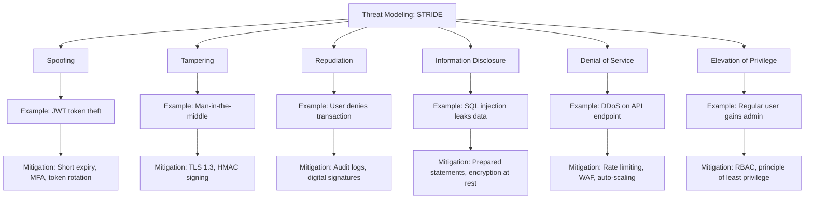
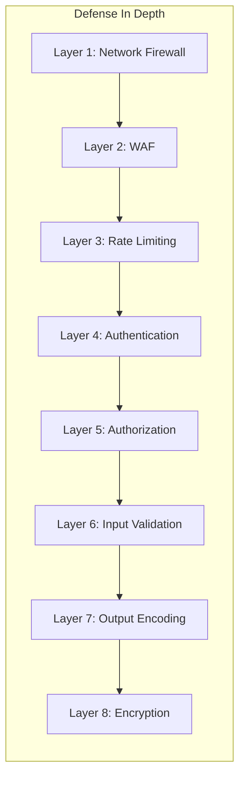

# Chapter 10: Security Architecture

## Learning Objectives

- Conduct threat modeling
- Implement penetration testing
- Build secure by design systems
- Handle bug bounty programs

---





## 10.1 Threat Modeling (STRIDE)

```php
<?php
class ThreatModel
{
    public function analyze(string $component): array
    {
        $threats = [];

        // STRIDE categories
        $threats[] = $this->analyzeSpoofing($component);
        $threats[] = $this->analyzeTampering($component);
        $threats[] = $this->analyzeRepudiation($component);
        $threats[] = $this->analyzeInformationDisclosure($component);
        $threats[] = $this->analyzeDenialOfService($component);
        $threats[] = $this->analyzeElevationOfPrivilege($component);

        return array_filter($threats);
    }

    private function analyzeSpoofing(string $component): ?Threat
    {
        // Can someone impersonate a user/service?
        if ($component === 'api') {
            return new Threat(
                category: 'Spoofing',
                description: 'JWT token theft could allow impersonation',
                severity: 'High',
                mitigation: 'Implement token rotation, short expiry, and MFA',
            );
        }
        return null;
    }

    private function analyzeTampering(string $component): ?Threat
    {
        // Can data be modified in transit?
        return new Threat(
            category: 'Tampering',
            description: 'Data in transit could be modified',
            severity: 'High',
            mitigation: 'Use TLS 1.3, sign requests with HMAC',
        );
    }

    private function analyzeDenialOfService(string $component): ?Threat
    {
        // Can the system be overwhelmed?
        return new Threat(
            category: 'Denial of Service',
            description: 'API endpoint could be flooded',
            severity: 'Medium',
            mitigation: 'Rate limiting, WAF, auto-scaling',
        );
    }
}

// Security middleware
class SecurityMiddleware
{
    private array $headers = [
        'X-Content-Type-Options' => 'nosniff',
        'X-Frame-Options' => 'DENY',
        'X-XSS-Protection' => '1; mode=block',
        'Strict-Transport-Security' => 'max-age=31536000; includeSubDomains',
        'Content-Security-Policy' => "default-src 'self'; script-src 'self'",
        'Referrer-Policy' => 'strict-origin-when-cross-origin',
        'Permissions-Policy' => 'geolocation=(), microphone=(), camera=()',
    ];

    public function apply(): void
    {
        foreach ($this->headers as $header => $value) {
            header("{$header}: {$value}");
        }
    }

    public function validateRequest(): void
    {
        // Validate Content-Type
        if ($_SERVER['REQUEST_METHOD'] === 'POST') {
            $contentType = $_SERVER['CONTENT_TYPE'] ?? '';
            if (!str_contains($contentType, 'application/json')) {
                http_response_code(415);
                exit;
            }
        }

        // Validate Content-Length
        $contentLength = (int)($_SERVER['CONTENT_LENGTH'] ?? 0);
        if ($contentLength > 10_000_000) { // 10MB max
            http_response_code(413);
            exit;
        }
    }
}
```

---

## 10.2 Exercises

1. Conduct a threat model for an e-commerce application
2. Implement security headers and validate them
3. Set up a penetration testing pipeline
4. Create a security incident response plan

---

## Further Reading

- **Doc:** [OWASP Cheat Sheets](https://cheatsheetseries.owasp.org/)
- **Doc:** [CVE Database](https://cve.mitre.org/)
