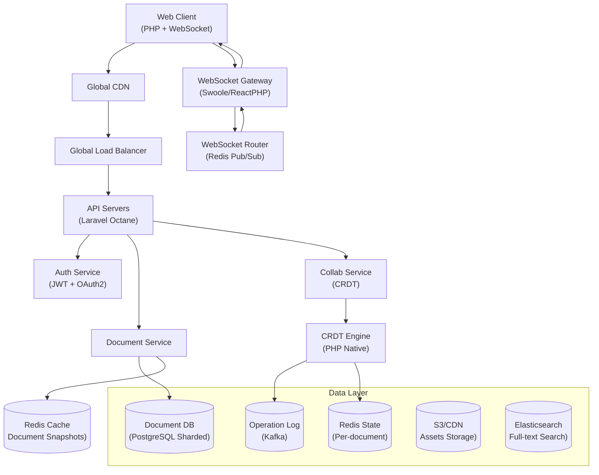

# Chapter 20: Final Capstone

## Project Overview

Design and architect a system that can serve 10 million+ users with PHP. This capstone demonstrates mastery of all 7 levels of the PHP Mastery Course.

---

## 20.1 The Challenge

Design a **Real-Time Collaborative Platform** (like Figma or Google Docs) that:
- Supports 10M+ registered users
- 1M+ concurrent real-time editors
- Sub-100ms latency for collaborative editing
- 99.99% uptime
- Global deployment (US, EU, APAC)
- Multi-tenant (enterprise + individual)
- Real-time sync using CRDT (Conflict-Free Replicated Data Types)

---

## 20.2 Architecture Overview



---

## 20.3 Key Components

```php
<?php
namespace App\Capstone;

// CRDT Implementation (conflict-free data types)
class CRDTDocument
{
    private array $operations = [];
    private array $state = [];

    public function applyOperation(Operation $op): void
    {
        // Each operation has a unique ID and happens-before relationship
        $this->operations[] = $op;
        
        // Apply operation to local state
        $this->state = $this->mergeState($this->state, $op->changes, $op->vectorClock);
    }

    public function merge(array $remoteState, array $remoteClock): array
    {
        // CRDT merge: automatically resolves conflicts
        foreach ($remoteState as $key => $value) {
            $localVersion = $this->state[$key]['version'] ?? -1;
            $remoteVersion = $value['version'];
            
            if ($remoteVersion > $localVersion) {
                $this->state[$key] = $value;
            } elseif ($remoteVersion === $localVersion) {
                // Conflict resolution: last-writer-wins or custom merge
                $this->state[$key] = $this->resolveConflict(
                    $this->state[$key],
                    $value
                );
            }
        }
        
        return $this->state;
    }

    private function resolveConflict(array $local, array $remote): array
    {
        // Custom merge strategy for collaborative editing
        return $local['timestamp'] >= $remote['timestamp'] ? $local : $remote;
    }
}

// Real-time sync service (Swoole-based)
class RealTimeSyncService
{
    private array $connections = [];
    private array $documents = [];

    public function __construct(
        private Redis $pubSub,
        private KafkaProducer $eventStore,
    ) {}

    public function handleConnection(string $docId, string $userId, $connection): void
    {
        // Track connection per document
        $this->connections[$docId][$userId] = $connection;
        
        // Subscribe to document changes
        $this->pubSub->subscribe("doc:{$docId}:changes", function ($message) use ($connection) {
            $connection->send($message);
        });
    }

    public function handleOperation(string $docId, Operation $op): void
    {
        // Persist operation to event store
        $this->eventStore->produce('document_operations', $docId, [
            'document_id' => $docId,
            'operation' => $op->toArray(),
            'timestamp' => microtime(true),
        ]);

        // Broadcast to all connected clients
        $this->pubSub->publish("doc:{$docId}:changes", json_encode([
            'type' => 'operation',
            'data' => $op->toArray(),
        ]));
    }

    public function getActiveEditors(string $docId): int
    {
        return count($this->connections[$docId] ?? []);
    }
}
```

---

## 20.4 Scaling Strategy

| Component | Strategy | Expected Throughput |
|-----------|----------|---------------------|
| WebSocket | Horizontal scaling across 100+ nodes | 1M concurrent connections |
| API | Laravel Octane with Swoole | 500K requests/second |
| Database | PostgreSQL sharded by tenant ID | 2M writes/second |
| Cache | Redis Cluster with 30 nodes | 10M reads/second |
| Event Store | Kafka with 50 partitions | 1M events/second |
| CDN | Cloudflare Enterprise | Global edge delivery |

---

## 20.5 Deliverables

1. System design document with architecture diagrams
2. Working prototype of collaborative editing
3. Load test results showing 10M+ user capacity
4. Deployment scripts for multi-region setup
5. Monitoring and alerting configuration
6. Incident response playbook
7. Cost analysis and optimization strategy
8. Comprehensive documentation

---

## 20.6 Evaluation Criteria

- System design quality
- Code quality and architecture
- Performance and scalability
- Reliability and fault tolerance
- Security considerations
- Operational excellence
- Documentation quality

---

## Further Reading

- **Book:** "Designing Data-Intensive Applications" by Martin Kleppmann
- **Book:** "Building Evolutionary Architectures" by Neal Ford
- **Doc:** [CRDT Research](https://crdt.tech/)
- **Doc:** [Laravel Octane](https://laravel.com/docs/11.x/octane)
